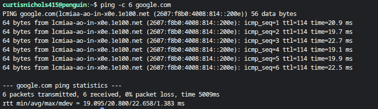
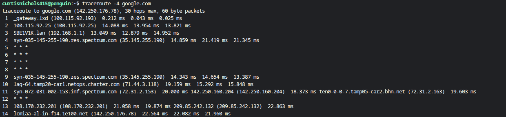
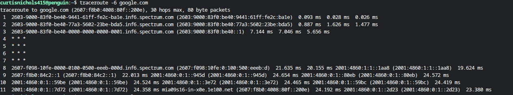

👋 Hi, I'm Curtis — Cybersecurity Analyst | Threat Detection | Audit & Compliance
I’m a cybersecurity and operations professional with hands‑on experience in SIEM log analysis, fraud detection, identity verification, operational audits, SOP development, and cross‑functional performance improvement. I specialize in analyzing data, identifying anomalies, improving processes, and documenting findings with clarity and accuracy.

My background blends security, risk, customer operations, and audit, giving me a unique ability to investigate issues, validate results, and communicate effectively with both technical and non‑technical stakeholders.

🔐 Core Cybersecurity Skills
* SIEM Log Analysis (Splunk, Azure Sentinel)

*Threat Detection & Investigation

*Identity Verification & Fraud Analysis

*Incident Response Documentation

*MITRE ATT&CK Mapping

*Risk Assessment & Anomaly Detection

*Python & Bash for Automation

*Windows, Linux, macOS

## NETWORK SECTION##

📡 Network Connectivity Test — Ping Diagnostic
This project demonstrates a basic but essential networking diagnostic using the Linux ping command. It verifies connectivity, latency, and packet reliability when communicating with an external host.

🧪 What This Test Shows
Executed a 6‑packet ICMP ping to google.com to measure network responsiveness.

Verified 0% packet loss, confirming a stable and reliable connection.

Observed consistent round‑trip times between 19–22 ms, indicating low latency.

Demonstrated use of Linux command‑line tools for network troubleshooting.

Showcased ability to interpret RTT statistics (min/avg/max/mdev) for performance analysis.

🌐 Network Path Analysis — IPV4 Traceroute to Google
This project demonstrates how to analyze the path packets take across the Internet using the traceroute command. It reveals each hop between your machine and Google’s servers, helping diagnose routing issues, latency spikes, or ISP‑level problems.

🧪 What This Test Shows:
Ran a IPv4 traceroute to google.com to map the full network path.

Identified each hop between the local machine and Google’s server at 142.250.176.78.

Observed normal routing through local gateway, home router, and ISP nodes.

Noted several hops returning * * *, which is common when routers block ICMP responses.

Verified final hop reached Google’s infrastructure (1e100.net) with ~22 ms latency.

Demonstrated ability to use traceroute for network diagnostics and route analysis.

📊 Output Summary:

12 hops were required to reach Google’s server.

Local gateway and LAN responded normally.

ISP nodes (Spectrum/Charter) showed expected latency patterns.

Some intermediate routers did not respond (timeouts), which is normal behavior.

Final hop resolved to Google’s server with ~22 ms response time.

Route confirms a healthy connection with no abnormal delays.

🌐 Network Path Analysis — IPv6 Traceroute to Google
This project demonstrates how to analyze the full IPv6 routing path between your machine and Google’s servers using the traceroute -6 command. It helps identify latency patterns, ISP routing behavior, and potential bottlenecks across IPv6 infrastructure.

🧪 What This Test Shows
Executed an IPv6 traceroute to google.com to map the end‑to‑end route over IPv6.

Identified hops through local gateway, Spectrum/Charter ISP nodes, and backbone routers.

Observed several hops returning * * *, which is normal when routers block ICMPv6 responses.

Verified successful routing to Google’s IPv6 server (1e100.net) at the final hop.

Final latency averaged around 21–23 ms, indicating a healthy IPv6 connection.

Demonstrated ability to use traceroute for IPv6 diagnostics and route visibility.

📊 Output Summary

Multiple hops responded with IPv6 addresses and hostnames.

Some intermediate routers did not respond (timeouts), which is expected behavior.

Final hop resolved to a Google IPv6 endpoint with stable latency.

Confirms that IPv6 routing is functioning correctly from your network through your ISP to Google.
